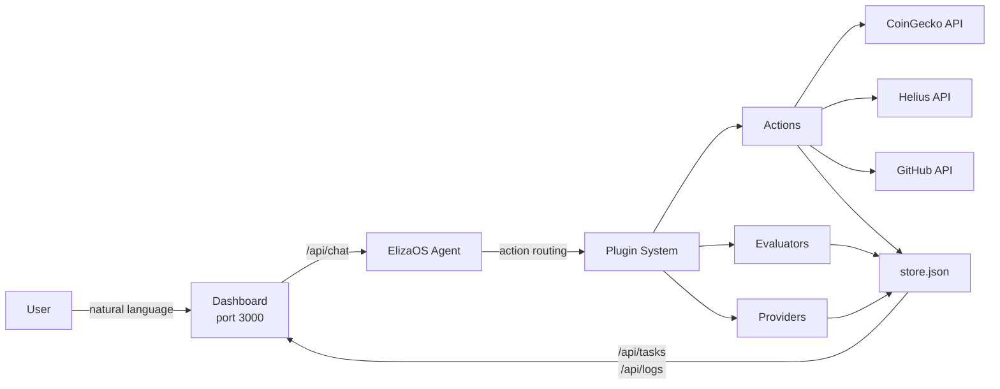

# ElizClaw

ElizClaw embodies the OpenClaw ethos — your agent, your data, your infrastructure. It runs on decentralized compute you control, watches your portfolio without asking permission, and logs every decision for you to audit. No cloud lock-in. No subscription. Just an agent that works.

Built on ElizaOS v2 · Deployed on Nosana GPU Network · Powered by Qwen3.5-27B

## Features

### Task Automation
Describe a recurring task in natural language. It gets parsed, scheduled, and executed automatically.
- **Price monitoring** — track crypto prices with custom alert thresholds and market context
- **Web scraping** — fetch and summarize any website on a schedule
- **API calls** — make HTTP requests to any endpoint on a schedule

### On-Chain Intelligence
- **Wallet tracking** — connect a Solana wallet, get portfolio analysis with AI-generated narrative and smart money context
- **Whale watching** — track notable wallets and get alerts on large transfers with visual timeline
- **Signal monitoring** — aggregate trending coins, dev activity, and market sentiment

### Agent Intelligence
- **Self-reporting** — ask "how are you performing?" and the agent audits its own execution statistics
- **Narrative alerts** — price thresholds include broader market context (trending, sentiment)
- **Smart money synthesis** — cross-references your holdings with whale activity automatically

### Dashboard
- **Live task status** — running/completed/failed with visual indicators
- **Whale timeline** — color-coded on-chain activity feed
- **Sparkline charts** — inline price history for monitored assets
- **Export/Import** — back up and restore tasks as JSON
- **Quick commands** — one-click prompt chips for common actions

## How It Works



ElizaOS v2 uses three core concepts: **Actions** define what the agent can do (fetch prices, track wallets, scrape web pages), **Providers** inject context into the agent's awareness (active tasks, execution memory), and **Evaluators** learn from outcomes (auto-logging every task as success or failure). ElizClaw extends this with 11 custom actions, 3 context providers, and 1 evaluator — all with Zod-validated inputs and structured error handling.

Tasks created via natural language are stored and executed autonomously by a background scheduler that polls every 60 seconds. The agent doesn't wait for you to ask — it watches continuously, executes on schedule, and logs every result. One slow task never blocks others thanks to a concurrency-limited queue (max 2 simultaneous).

In production, the entire stack (dashboard UI + API routes + agent runtime) runs on a single port, served from one Express server. This enables clean deployment on decentralized compute networks like Nosana — no multi-container orchestration, no separate frontend process. In local development, the frontend and agent run on separate ports for a faster, more convenient dev experience.

## Architecture Decisions

| Decision | Choice | Reasoning |
|---|---|---|
| **Persistence** | JSON file store | Zero-ops deployment on Nosana; no database process to manage. Production path: Postgres adapter already wired in `database/index.ts`. |
| **Scheduling** | `setInterval` + p-queue | Lightweight, no message broker dependency. Concurrency: 2 prevents resource exhaustion on shared GPU nodes. |
| **Frontend** | Next.js static export | Single binary deployment — served directly from the agent's Express server. No separate frontend process or container. |
| **Validation** | Zod schemas | Type-safe input validation at action boundaries. Fails fast with user-friendly messages. |
| **Logging** | pino JSON | Structured logs optimized for Docker log aggregation on Nosana. `pino-pretty` for local development readability. |
| **Wallet data** | Helius + Jupiter fallback | Enhanced Solana data via Helius when available; gracefully degrades to Jupiter price feeds without API key. |
| **On-chain intelligence focus** | Monitoring over execution | After researching 5,400+ projects, identified that DeFi execution is saturated. Monitoring + intelligence is the unsolved gap. |

## Quick Start

```bash
bun install
cp .env.example .env
# Edit .env — set OPENAI_API_KEY and OPENAI_API_URL

# Start the agent (port 3000)
bun run dev

# In another terminal, start the frontend (port 3001)
cd frontend && bun install && bun run dev
```

Or with Docker:

```bash
docker compose up --build
```

## Usage Examples

### Create Tasks

Tell ElizClaw what to automate:

```
Check BTC price every morning and alert me if it's above $100k
```

It parses this into a structured task:
- **Type:** Price Monitor
- **Symbol:** BTC
- **Threshold:** $100,000
- **Schedule:** Daily at 8:00 AM
- **Condition:** price > $100,000

### Monitor Prices

```
What's BTC price?
Track SOL price with alert at $200
```

### Track Wallets

```
Check my wallet balance 7xKq...pR3m
Track wallet 9WzD...AWWM
```

### Whale Watching

```
Track the Binance cold wallet
What whales are moving?
```

### Market Signals

```
What's happening in the crypto market?
Show me trending coins
```

### Agent Self-Report

```
How are you performing?
Show me your status report
```

### Prediction Markets

```
Place a $10 bet on BTC above $100k by Friday
Start a price guess game
```

## Configuration

| Variable | Default | Description |
|---|---|---|
| `OPENAI_API_KEY` | — | Your model API key |
| `OPENAI_API_URL` | `http://localhost:8000/v1` | Model endpoint URL |
| `DATA_DIR` | `./data` | Directory for persistent data (tasks, logs, bets) |
| `HELIUS_API_KEY` | — | (Optional) Enhanced Solana wallet data via Helius API |
| `SERVER_PORT` | `3000` | Agent API port |
| `NODE_ENV` | `development` | Set to `production` for single-port mode |

## Plugins

### elizclaw (main plugin — 10 actions)

| Type | Name | What it does |
|------|------|-------------|
| Action | CREATE_TASK | Parses natural language → structured scheduled task |
| Action | EXECUTE_TASK | Runs a task by dispatching to type-specific handlers |
| Action | MONITOR_PRICE | Fetches CoinGecko price with threshold alerts + market context |
| Action | WEB_SCRAPE | Fetches URL, strips HTML, returns text summary |
| Action | API_CALL | Makes HTTP requests to any endpoint |
| Action | PREDICTION_MARKET | Places bets on crypto price outcomes with simulated odds |
| Action | WALLET_TRACKER | Tracks Solana wallet with portfolio analysis + smart money context |
| Action | WHALE_WATCHER | Monitors notable wallets and alerts on large transfers |
| Action | SIGNAL_MONITOR | Aggregates trending coins, dev activity, market signals |
| Action | AGENT_REPORT | Self-reports execution statistics and performance |
| Provider | tasks | Surfaces active tasks and schedules to agent context |
| Provider | memory | Surfaces recent execution history to agent context |
| Evaluator | taskCompletion | Auto-logs task outcomes (success/failure) |

### priceGuess (game plugin)

| Type | Name | What it does |
|------|------|-------------|
| Action | PRICE_GUESS_GAME | Starts game round or records a price guess |
| Provider | priceGuess | Surfaces active bets and guesses to agent context |

### Persistence

All persistent data (tasks, logs, bets, guesses, wallets) is stored in `data/store.json` via `src/plugins/store.ts`. The ElizaOS SQLite adapter handles conversation memory separately in `data/db.sqlite`.

## Code Structure

```
elizclaw/
├── src/
│   ├── index.ts              # Agent runtime + Express dashboard routes
│   ├── character.ts          # Agent personality and examples
│   ├── config/index.ts       # Argument parsing, token resolution
│   ├── lib/
│   │   ├── error-handler.ts  # Global error handling (AppError + sanitize)
│   │   └── logger.ts         # Structured logging (pino)
│   ├── plugins/
│       ├── elizclaw.ts       # Main plugin (11 actions)
│       ├── priceGuess.ts     # Price game plugin
│       ├── store.ts          # JSON file-based persistence with write mutex
│       ├── utils/
│       │   ├── http.ts       # HTTP utility with retries, timeouts, rate-limit
│       │   └── schemas.ts    # Zod validation schemas for all actions
│       ├── actions/          # 11 action handlers
│       │   ├── createTask.ts
│       │   ├── executeTask.ts
│       │   ├── monitorPrice.ts
│       │   ├── webScrape.ts
│       │   ├── apiCall.ts
│       │   ├── predictionMarket.ts
│       │   ├── walletTracker.ts    # Portfolio analysis + smart money context
│       │   ├── whaleWatcher.ts     # Whale movement alerts
│       │   ├── signalMonitor.ts    # Market signal aggregation
│       │   └── agentReport.ts      # Agent self-reporting
│       ├── providers/        # 3 context providers
│       └── evaluators/       # 1 task completion evaluator
├── frontend/                 # Next.js 14 dashboard (static export)
├── nos_job_def/              # Nosana job definition
├── Dockerfile
├── docker-compose.yaml
├── start.mjs                 # Process manager + background scheduler
└── package.json
```

## Docker

```bash
docker compose up --build
```

Single-port mode: agent serves both API and dashboard on port 3000. Multi-stage build using `oven/bun:1-slim`.

## Nosana Deployment

1. Register at [nosana.com/builders-credits](https://nosana.com/builders-credits) for free compute credits
2. Build and push Docker image: `docker build -t yourusername/elizclaw:latest . && docker push yourusername/elizclaw:latest`
3. Update `nos_job_def/nosana_eliza_job_definition.json` with your image name and API keys
4. Deploy via [deploy.nosana.com](https://deploy.nosana.com) or CLI: `nosana job post --file ./nos_job_def/nosana_eliza_job_definition.json --market nvidia-3090 --timeout 300`

Required environment variables:
```
OPENAI_API_KEY=<your_model_api_key>
OPENAI_API_URL=<your_model_endpoint>
DATA_DIR=/app/data
HELIUS_API_KEY=<optional_helius_key>
```

## Tech

| Layer | Technology |
|---|---|
| Framework | ElizaOS 0.1.9 |
| Model | Qwen3.5-27B-AWQ-4bit (OpenAI-compatible endpoint) |
| Runtime | Node.js 23+, Bun |
| Frontend | Next.js 14, TailwindCSS, React 18 (static export) |
| Validation | Zod 4.x |
| Logging | pino (JSON in production, pretty in dev) |
| Database | SQLite (adapter-sqlite + JSON store with write mutex) |
| Container | Docker (oven/bun:1-slim, single-port) |
| Deploy | Nosana decentralized GPU |

## License

MIT
